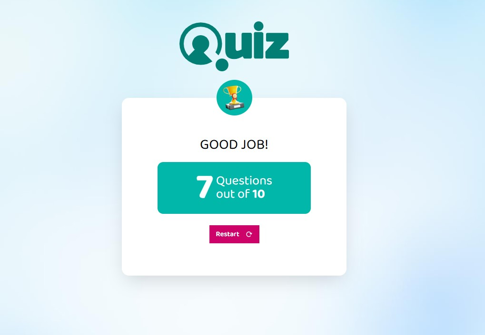
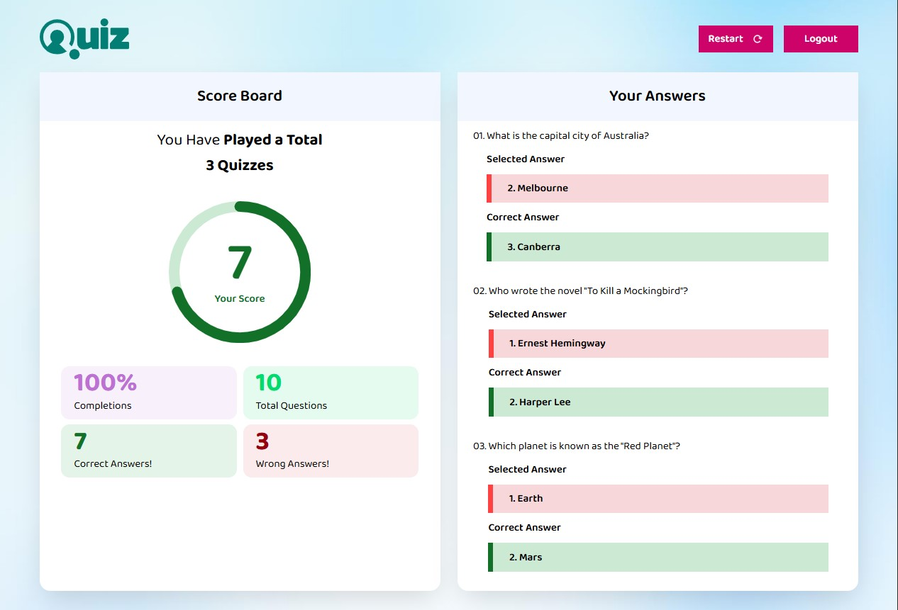

#  WSA Quiz Application

A full-stack **Quiz Web Application** built using the **MERN stack** (MongoDB, Express.js, React.js, Node.js). This project is split into two levels of complexity — each implemented with separate frontend and backend setups.

---

## 🛠️ Tech Stack

- **Frontend:** React.js, HTML5, CSS3, JavaScript
- **Backend:** Node.js, Express.js
- **Database:** MongoDB + MongoDB Compass
- **Other Tools:** Redux, Postman, Git, npm

---

## 🧰 Prerequisites

- [Node.js](https://nodejs.org/)
- [MongoDB + Compass](https://www.mongodb.com/products/compass)
- Git
- npm

---

## 📁 Folder Structure

├── level1<br>
│ ├── frontend<br>
│ └── backend<br>
├── level2<br>
│ ├── frontend<br>
│ └── backend<br>

Each level contains its own **frontend** and **backend** codebases. You must run both parts simultaneously for full functionality.

---

## ✅ Level 1

- Setup component structure and global state using Context API.
- Develop UI screens: Welcome, Questions, and Results.
- Integrate quiz-related APIs and state management.

✨ **Key Features**:

- Welcome, Quiz, and Result Screens
- Global state with React's Context API
- API Integration and Score Submission
- Error handling for quiz submissions

## Screenshot: 


**Live Demo** : [Click here to view Level 1](https://wsa-quiz-app-level1.netlify.app/)

---

## ✅ Level 2

- Replace Context API with Redux Toolkit.
- Add Login, Signup, and Enhanced Result screens.
- Secure routes and enhance error handling.

✨ **Key Features**:

- User Authentication (Login / Signup)
- Redux Toolkit for global state
- Route Protection & Middleware
- Enhanced Result Screen with User Info
- Feature-specific error handling

## Screenshot: 


**Live Demo** : [Click here to view Level 2](https://wsa-quiz-app-level2.netlify.app/)

---

## 📌 How to Run Locally

1. **Clone the Repository:**  
   ```bash
   git clone https://github.com/EmertxeInfoTech/wsa-quiz-app.git
   cd wsa-quiz-app
   
2. **Install Dependencies:** <br>
   **cd** level1/frontend<br>
   **npm** install<br>
   **cd** level1/backend<br>
   **npm** install

3. **Follow the same for level 2 also** <br>

4. **In each backend folder, create a .env file:** <br>
   **SERVER_PORT**=8000<br>
   **ENVIRONMENT**=DEVELOPMENT<br>
   **DATABASE_URI**=mongodb://localhost:27017/wsa_quiz-app

5. **In each frontend folder, create a .env file:** <br>
   **REACT_APP_API_BASE_URL**=http://localhost:8000 <br>

6. **Start both frontend and backend for each level in separate terminals.** <br>
   **Backend**<br>
   **cd** level1/backend <br>
   **npm** start

   **Frontend**<br>
   **cd** level1/frontend<br>
   **npm** start

7. **Follow the same for level 2 also**

## 📄 License
© 2023 WSA. All rights reserved.
   
